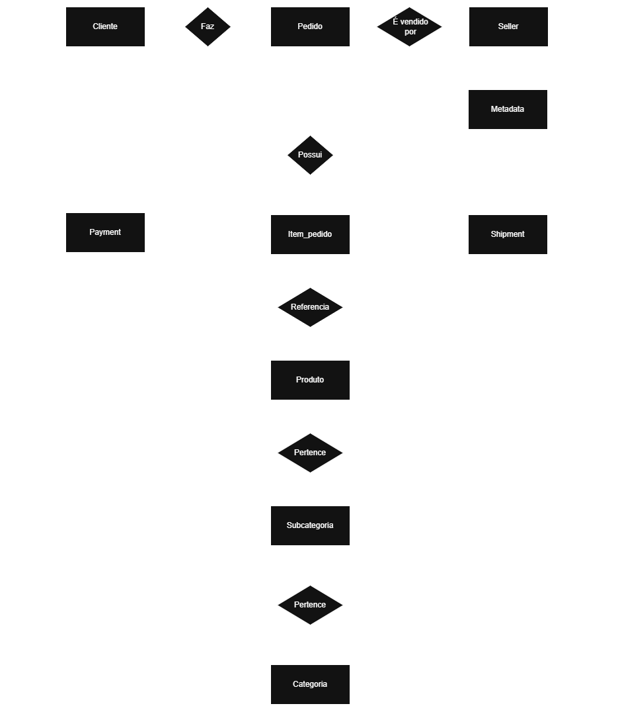

# Projeto Mensageria
Trabalho 1º bimestre - Computação em Nuvem II - FATEC

---

## Tecnologias

| Camada         | Tecnologia                                  |
| -------------- | ------------------------------------------- |
| Linguagem      | Java 21                                     |
| Framework      | Spring Boot 4.0.5                           |
| Persistência   | Spring Data JPA / Hibernate 7               |
| Banco de Dados | PostgreSQL 15 (Docker)                      |
| Mensageria     | Google Cloud Pub/Sub (`google-cloud-pubsub`) |
| Documentação   | SpringDoc OpenAPI 3.0.2 (Swagger UI)        |
| Frontend       | HTML + CSS + JavaScript (servido pelo Spring Boot) |

---

## 📊 Banco de Dados

### 🧩 Diagrama Entidade-Relacionamento (DER)



### 🧠 Modelagem

O modelo foi estruturado de forma normalizada, separando entidades como **customer**, **order**, **order_item**, **category** e **sub_category**.

A tabela **orders** armazena as informações principais do pedido, enquanto **order_items** representa a relação entre pedidos e produtos, permitindo múltiplos itens por pedido.

Entidades complementares como **payments**, **shipments** e **order_metadata** foram modeladas separadamente para manter organização, flexibilidade e aderência ao payload da aplicação.

O campo **indexed_at** registra o momento em que a mensagem foi persistida no banco, atendendo ao requisito de rastreabilidade da ingestão.

Os valores totais dos pedidos e itens **não são armazenados no banco**, sendo calculados dinamicamente pela API conforme regra de negócio.

### Tabelas

| Tabela           | Descrição                                      |
| ---------------- | ---------------------------------------------- |
| `orders`         | Pedidos (uuid, status, channel, created_at, indexed_at) |
| `customers`      | Clientes (id, name, email, document)           |
| `sellers`        | Vendedores (id, name, city, state)             |
| `order_items`    | Itens do pedido (product_id, product_name, unit_price, quantity) |
| `categories`     | Categorias dos produtos                        |
| `sub_categories` | Subcategorias dos produtos                     |
| `payments`       | Dados de pagamento (method, status, transaction_id) |
| `shipments`      | Dados de envio (carrier, service, tracking_code) |
| `order_metadata` | Metadados (source, user_agent, ip_address)     |

### 📘 Dicionário de Dados

| Tabela      | Campo      | Tipo      | Descrição                       |
| ----------- | ---------- | --------- | ------------------------------- |
| orders      | uuid       | VARCHAR   | Identificador único do pedido   |
| orders      | status     | VARCHAR   | Status do pedido (CREATED, PAID, SHIPPED, DELIVERED, CANCELED, PENDING, CONFIRMED, SEPARATED) |
| orders      | indexed_at | TIMESTAMP | Data/hora de ingestão no banco  |
| order_items | quantity   | INT       | Quantidade do produto no pedido |
| order_items | unit_price | DECIMAL   | Preço unitário do produto       |

---

## 📨 Consumer (Pub/Sub)

O consumer conecta ao Google Cloud Pub/Sub e consome mensagens de pedidos em tempo real.

- **Projeto GCP:** `serjava-demo`
- **Subscription:** `sub-grupo6`
- **Credenciais:** arquivo `key.json` na raiz do repositório
- **Deduplicação:** verifica UUID antes de persistir (evita duplicatas)
- **Ack/Nack:** mensagens processadas com sucesso recebem `ack`, falhas recebem `nack`

**Fluxo:** Pub/Sub → `PubSubSubscriber` → `OrderService.processOrder()` → Banco de Dados

---

## 🔌 API REST

### Endpoints

#### `GET /orders`
Lista pedidos com paginação, ordenação e filtros.

| Parâmetro      | Tipo   | Obrigatório | Descrição              |
| -------------- | ------ | ----------- | ---------------------- |
| `status`       | String | Não         | Filtra por status      |
| `customer_id`  | Long   | Não         | Filtra por ID cliente  |
| `product_id`   | Long   | Não         | Filtra por ID produto  |
| `page`         | int    | Não         | Página (default: 0)    |
| `size`         | int    | Não         | Itens/página (default: 20) |
| `sort`         | String | Não         | Ordenação (default: createdAt,desc) |

**Exemplos:**
```
GET /orders
GET /orders?status=PAID&page=0&size=10
GET /orders?customer_id=58706
GET /orders?product_id=1190&status=SHIPPED
```

#### `GET /orders/{uuid}`
Retorna um pedido completo pelo UUID com todos os relacionamentos.

```
GET /orders/b28ab819-c950-485b-8a4f-d1e022315a74
```

### Contrato de Resposta

Os valores `total` do pedido e de cada item são **calculados dinamicamente**:
- `item.total` = `unit_price × quantity`
- `order.total` = soma de todos `item.total`

```json
{
  "uuid": "ORD-2025-0001",
  "created_at": "2025-10-01T10:15:00",
  "channel": "mobile_app",
  "total": 5000.00,
  "status": "SEPARATED",
  "customer": {
    "id": 7788,
    "name": "Maria Oliveira",
    "email": "maria@email.com",
    "document": "987.654.321-00"
  },
  "seller": {
    "id": 55,
    "name": "Tech Store",
    "city": "São Paulo",
    "state": "SP"
  },
  "items": [
    {
      "product_id": 9001,
      "product_name": "Smartphone X",
      "unit_price": 2500.00,
      "quantity": 2,
      "category": {
        "id": "ELEC",
        "name": "Eletrônicos",
        "sub_category": {
          "id": "PHONE",
          "name": "Smartphones"
        }
      },
      "total": 5000.00
    }
  ],
  "shipment": {
    "carrier": "Correios",
    "service": "SEDEX",
    "status": "shipped",
    "tracking_code": "BR123456789"
  },
  "payment": {
    "method": "pix",
    "status": "approved",
    "transaction_id": "pay_987654321"
  },
  "metadata": {
    "source": "app",
    "user_agent": "Mozilla/5.0...",
    "ip_address": "10.0.0.1"
  },
  "indexed_at": "2025-10-01T10:15:02"
}
```

---

## 🖥️ Frontend Dashboard

Dashboard web servido pelo próprio Spring Boot para visualização dos pedidos.

**Funcionalidades:**
- Tabela de pedidos com UUID, cliente, status, canal, total e data
- Filtros por status, ID do cliente e ID do produto
- Paginação completa
- Modal de detalhes ao clicar em um pedido (cliente, vendedor, itens, envio, pagamento, metadata)
- Link para Swagger UI

**Acesso:** `http://localhost:8080`

---

## ⚙️ Como Rodar

### Pré-requisitos
- Java 21
- Docker (para PostgreSQL)
- Arquivo `key.json` na raiz do repositório (credenciais GCP)

### 1. Subir o banco de dados
```bash
cd backend
docker-compose up -d
```

### 2. Rodar a aplicação
```bash
cd backend
./mvnw spring-boot:run
```

> O Hibernate cria as tabelas automaticamente (`ddl-auto: create`).

### 3. Acessar

| Recurso        | URL                                  |
| -------------- | ------------------------------------ |
| Dashboard      | http://localhost:8080                 |
| Swagger UI     | http://localhost:8080/swagger-ui.html |
| API - Listar   | http://localhost:8080/orders          |
| API - Detalhe  | http://localhost:8080/orders/{uuid}   |

---

## 📁 Estrutura do Projeto

```
backend/
├── docker-compose.yml
├── pom.xml
└── src/main/java/com/pubsub6/grupo/
    ├── GrupoApplication.java
    ├── config/
    │   └── JacksonConfig.java
    ├── controller/
    │   └── OrderController.java          ← API REST
    ├── dto/
    │   ├── OrderDTO.java                 ← Deserialização mensagem
    │   ├── OrderResponseDTO.java         ← Resposta da API
    │   ├── OrderItemResponseDTO.java     ← Resposta item com total
    │   ├── CustomerDTO.java
    │   ├── SellerDTO.java
    │   ├── OrderItemDTO.java
    │   ├── CategoryDTO.java
    │   ├── SubCategoryDTO.java
    │   ├── ShipmentDTO.java
    │   ├── PaymentDTO.java
    │   └── OrderMetadataDTO.java
    ├── exception/
    │   ├── OrderNotFoundException.java
    │   └── GlobalExceptionHandler.java
    ├── model/
    │   ├── Order.java
    │   ├── Customer.java
    │   ├── Seller.java
    │   ├── OrderItem.java
    │   ├── Category.java
    │   ├── SubCategory.java
    │   ├── Shipment.java
    │   ├── Payment.java
    │   ├── OrderMetadata.java
    │   └── enums/OrderStatus.java
    ├── pubsub/
    │   ├── PubSubConfig.java             ← Configuração Subscriber
    │   └── PubSubSubscriber.java         ← Consumer de mensagens
    ├── repository/
    │   ├── OrderRepository.java
    │   ├── CustomerRepository.java
    │   ├── SellerRepository.java
    │   ├── CategoryRepository.java
    │   └── SubCategoryRepository.java
    └── service/
        └── OrderService.java             ← Lógica de negócio
database/
├── dernuvemII.drawio.png                 ← DER
├── schema.sql
└── indexes.sql
```
